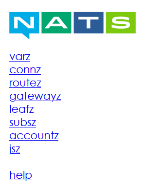

# nats-with-streaming

Docker compose file for nats and nats-streaming

---

### Usage

```shell
docker-compose up --build -d
```

### Monitoring

http://localhost:8224/



---

##### Special thanks to [@mpolatcan](https://github.com/mpolatcan) Mutlu Polatcan
